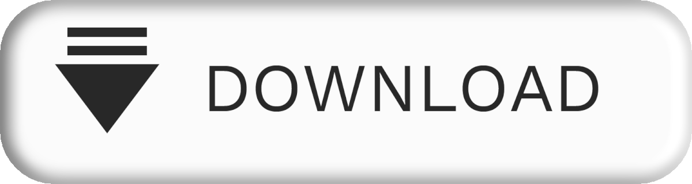

 <head>
    <meta charset="UTF-8">
    <meta name="viewport" content="width=device-width, initial-scale=1.0">
    <link rel="stylesheet" href="styles.css">
    <title>Menu CSS</title>
<body>
    
     
    <meta charset="UTF-8">
    <title>Welcome to Hacking-school</title>
</head>
<body>
    <meta charset="UTF-8">
    <meta name="viewport" content="width=device-width, initial-scale=1.0">

    <h1 class="multicolor">
        Bienvenue
         à l'école 
        Algéro-
        Canadienne 
        du 
        Hacking 
        et du Pentesting 
    </h1>
</body>
    

        <!-- liste -->
        <ul>

              
             

          </ul> 

              

    <a href="https://www.w3schools.com">Visit W3Schools</a>

</html>
